# Cross-label mask enabled prompt structure for configurable product recommendation

## Results on laptop dataset

### laptop dataset

|method|Processor|Graphic Card|Hard Disk|RAM|Screen|
|---|---|---|---|---|---|
|Single Task|47.1|55.7|48.0|45.8|62.4|
|MT-DNN|47.8|59.3|47.4|51.7|62.5|
|LACO|46.6|57.7|48.1|52.0|62.7|
|MTOP|47.4|57.3|47.8|52.5|60.7|
|CLM|**50.4**|**59.8**|**49.3**|**52.8**|**65.6**|

## Results for extended experiments

### Attempts to optimize CLM performance results

We tried several methods to optimize the CLM performance results. The methods include:

- Tune the hyper-parameters such as learning rate, batch size, etc.
- Weighting different loss terms: total loss = w_1\*L_1 + w_2\*L2 + ......
- Modify the model architecture via adding task-specific intermediate layers
- Early stopping: test the model in the middle of each epoch, not merely after each epoch

### Car seat dataset

|method|Seat Type|Weight Range|Installation Type|Harness Type|
|---|---|---|---|---|
|Single Task|40.5|57.1|64.9|65.1|
|MT-DNN|41.9|59.8|67.3|67.0|
|LACO|41.7|60.5|67.5|67.0|
|MTOP|40.6|60.3|67.0|67.1|
|CLM|42.7|61.5|68.7|67.7|
|CLM(optimized)|**43.0**|**62.1**|**69.6**|**69.4**|

### bike dataset

|method|Bike Type| Age Range| Wheel Size| Number of Speeds| Brake Style| Frame Material| Suspension Type
|---|---|---|---|---|---|---|---|
|Single Task|52.9|74.5|61.7|57.6|54.8|67.7|49.5|
|MT-DNN|56.8|76.1|62.3|58.4|53.1|67.6|49.7|
|LACO|57.1|76.1|61.8|57.8|54.3|67.9|50.7|
|MTOP|55.8|75.7|61.3|**59.5**|55.0|65.4|47.7|
|CLM|58.5|76.4|62.4|58.7|55.5|**69.3**|50.1|
|CLM(optimized)|**59.1**|**77.6**|**64.8**|59.0|**55.9**|68.5|**51.6**|

### smartwatch dataset

|method|Screen Size| Display Type| Battery Life
|---|---|---|---|
|Single Task|43.9|45.7|62.5|
|MT-DNN|44.4|45.9|63.7|
|LACO|44.2|44.9|64.6|
|MTOP|43.3|45.4|65.2|
|CLM|**45.5**|**47.5**|**66.5**|

# Theoretical foundation of Cross Label Mask

## Principle: Positive Conditional Mutual Information for CLM

**Proposition.**
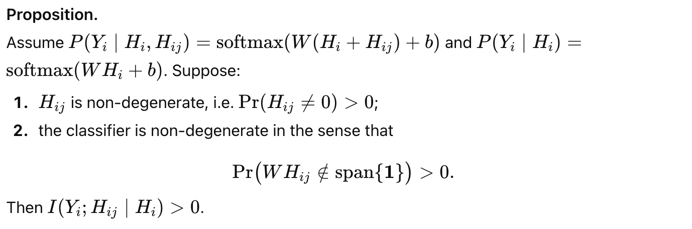

**Proof.**
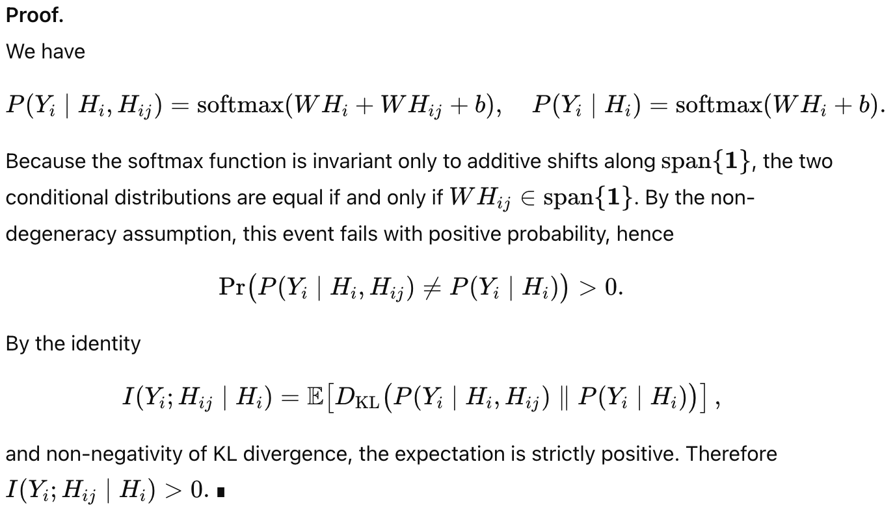

---

**One-sentence intuition**

> Since (H_{ij}) perturbs the logits in a non-uniform direction with positive probability, it changes the predictive distribution of (Y_i) beyond what (H_i) provides, yielding positive conditional mutual information.

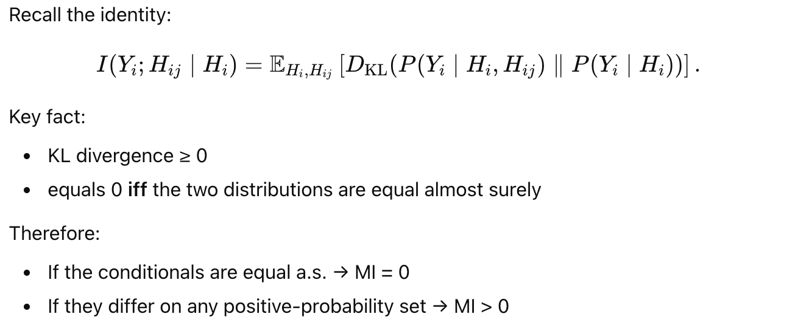

## Theorem: Provably Improved Error Lower Bound based on Fano Inequality

**Main Theorem.**
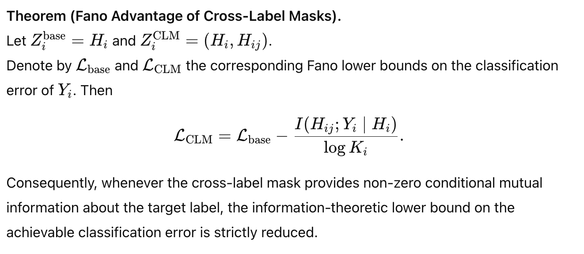

**Problem Setting**
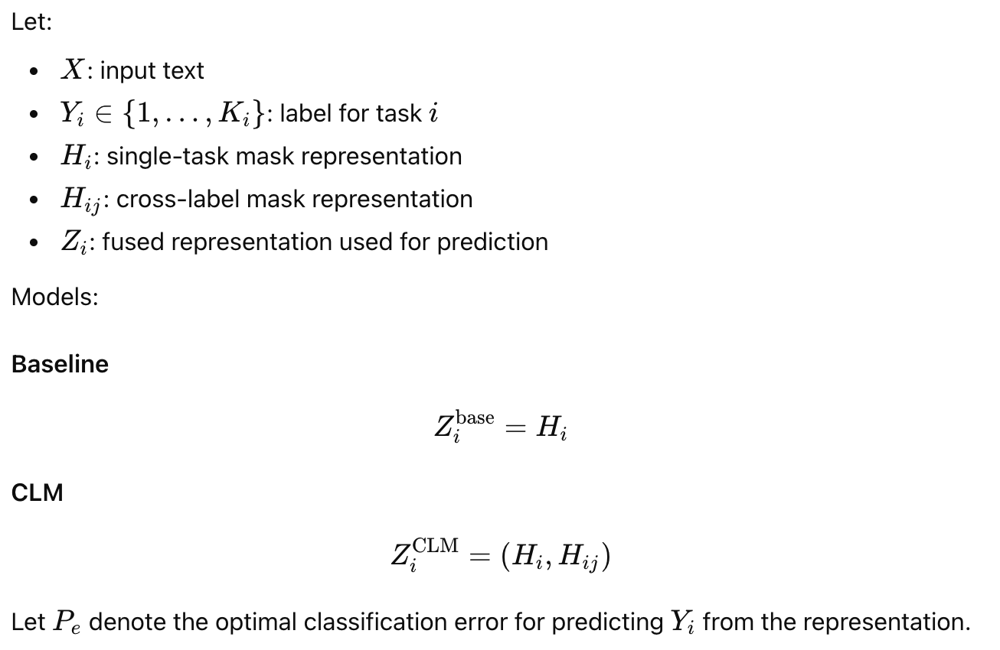

**Assumptions**
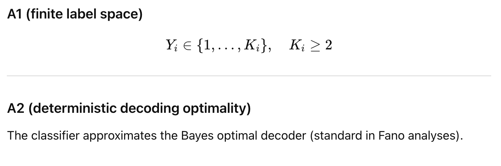

**Proof.**

**Step 1: Fano's Inequality**
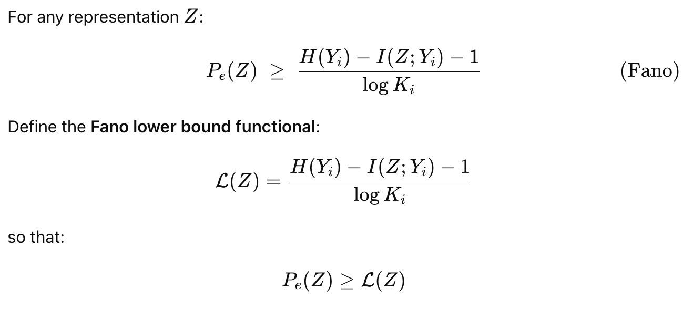

**Step 2: Apply Fano on baseline(No CLM)**
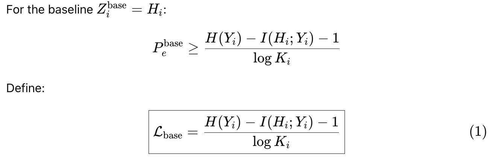

**Step 3: Decomposition of CLM's mutual information**
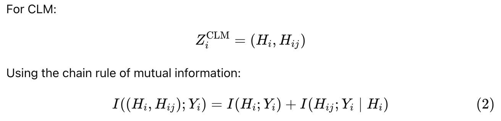

**Step 4: Apply Fano on CLM**
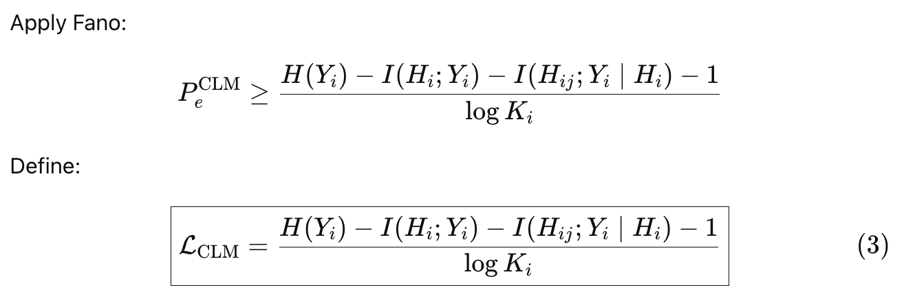

**Step 5: Connect two lower bounds by lower bounds subtraction**
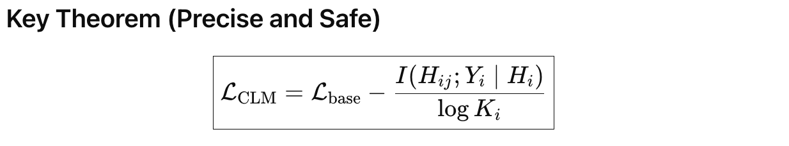

## Corollary
According to the Theorem, we know that

Given the first principle, we prove the condition holds. Therefore, we have the following corollary.
